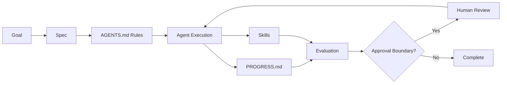

# AI Workflow Course

An open knowledge base and structured course for developers and
knowledge workers who want to integrate AI agents into real workflows.

This repository is about workflow design, not prompt tricks. The core
idea is simple: AI agents become much more reliable when work is
structured through explicit artifacts, bounded delegation, evaluation
loops, and security guardrails.

## Why This Exists

Many teams try to use AI agents by jumping straight into prompting. That
often produces output that is fast, plausible, and hard to trust.

This project teaches a more durable approach:

- define clear operating rules
- break work into bounded tasks
- preserve continuity across sessions
- evaluate outputs before accepting them
- introduce security and approval boundaries early

## Who This Is For

- Developers building software with AI agents
- Knowledge workers using AI agents for research, writing, operations,
  and synthesis
- Team leads designing repeatable AI-assisted workflows
- Trainers and facilitators who want course material they can turn into
  workshops or slide decks

## What You Will Learn

- How to use [`AGENTS.md`](AGENTS.md),
  [`PROGRESS.md`](PROGRESS.md), specs, and skills as workflow
  primitives
- How to improve reliability through specification precision, scope
  decomposition, and context architecture
- How to design evaluation loops and recognize common failure patterns
- How to add security, approvals, and governance without making
  workflows unusable
- How to adapt the same operating model for both software delivery and
  knowledge work

## Core Workflow

## Repository Structure

- [`docs/`](docs/): canonical reference for the framework
- [`course/`](course/): lesson material, slide outlines, exercises, and
  facilitator notes
- [`tracks/`](tracks/): audience-specific guidance for developers and
  workers
- [`templates/`](templates/): reusable artifacts split into shared,
  developer, and
  knowledge-worker templates
- [`examples/`](examples/): end-to-end case studies
- [`skills/`](skills/): reusable workflow skills and a shared index
- [`sessions/`](sessions/): workshop formats and delivery plans

Agent operating rules, context-loading sources, and execution policies
are defined in [`AGENTS.md`](AGENTS.md).

Track-level module deltas:

- Developer workflow deltas:
  [`examples/developers/rbac-admin-workflow/deltas/`](examples/developers/rbac-admin-workflow/deltas/)
- Knowledge-work deltas:
  [`examples/knowledge-workers/vendor-selection-workflow/deltas/`](examples/knowledge-workers/vendor-selection-workflow/deltas/)

## Project Operating Artifacts

- [`SPEC.md`](SPEC.md): current project objective, scope, constraints,
  and success
  criteria
- [`SKILL_EVIDENCE_REVIEW.md`](SKILL_EVIDENCE_REVIEW.md): reusable
  review skill for definition and
  evidence quality
- [`EVAL_CHECKLIST.md`](EVAL_CHECKLIST.md): project completion checklist
- [`APPROVAL_BOUNDARIES.md`](APPROVAL_BOUNDARIES.md): ask-first and
  approval gate actions
- [`docs/standards/MODULE_DONE_CHECKLIST_TEMPLATE.md`](docs/standards/MODULE_DONE_CHECKLIST_TEMPLATE.md):
  deterministic module done checklist template
- Scope decomposition principles:
  [`SPEC.md`](SPEC.md) and
  [`docs/reliability/scope-decomposition.md`](docs/reliability/scope-decomposition.md)

## Start Here

1. Read
   [`docs/foundations/operating-model.md`](docs/foundations/operating-model.md)
2. Read
   [`docs/primitives/agents-md.md`](docs/primitives/agents-md.md),
   [`docs/primitives/progress-md.md`](docs/primitives/progress-md.md),
   [`docs/primitives/skills.md`](docs/primitives/skills.md), and
   [`docs/primitives/specs.md`](docs/primitives/specs.md)
3. Read the reliability docs in [`docs/reliability/`](docs/reliability/)
4. Read the governance docs in [`docs/governance/`](docs/governance/)
5. Work through modules:
   1. [`course/modules/01-introduction/`](course/modules/01-introduction/)
   2. [`course/modules/02-workflow-operating-system/`](course/modules/02-workflow-operating-system/)
   3. [`course/modules/03-specification-precision/`](course/modules/03-specification-precision/)
   4. [`course/modules/04-scope-decomposition/`](course/modules/04-scope-decomposition/)
   5. [`course/modules/05-context-architecture/`](course/modules/05-context-architecture/)
6. Adapt the templates in [`templates/`](templates/) for your own
   workflow
7. Use the examples in [`examples/`](examples/) as reference
   implementations

## Course Design Standard

Each module is designed to include:

1. Learning objectives
2. Core concept
3. Failure mode
4. Good pattern
5. Bad pattern
6. Real example
7. Exercise
8. Reflection questions

This structure keeps the course useful for both self-study and live
facilitation.

## Audience Tracks

The framework is shared, but the application differs by audience.

- Developers: feature delivery, bugfixes, code review, validation,
  release readiness
- Knowledge workers: research briefs, writing workflows, meeting
  outputs, operational processes, review loops

The split happens mainly in [`tracks/`](tracks/),
[`templates/`](templates/), and [`examples/`](examples/), while the
core concepts remain shared in [`docs/`](docs/).

## Current Status

This repository is in active buildout.

Current v1 focus:

- shared reference docs for the operating model and reliability concepts
- introductory course modules with teaching assets
- shared and audience-specific templates
- developer and knowledge-worker case studies
- filled artifact bundles for one developer and one knowledge-work
  workflow example
- workshop-ready session plans

## How To Use This Repository

### If you want to learn the system

Follow the reading path above, then complete the module exercises and
adapt a template to one real workflow you own.

### If you want to teach the system

Use the content in [`course/`](course/) and [`sessions/`](sessions/) as
your base, then turn
the slide outlines into presentation decks and adapt exercises for your
audience.

### If you want to apply it immediately

Start with:

- [`templates/shared/AGENTS.example.md`](templates/shared/AGENTS.example.md)
- [`templates/shared/PROGRESS.example.md`](templates/shared/PROGRESS.example.md)
- [`templates/shared/SPEC.example.md`](templates/shared/SPEC.example.md)

Then move into the audience-specific templates that match your work.

## Roadmap

- Expand the developer and knowledge-worker template packs
- Build out the remaining modules in
  [`course/modules/`](course/modules/)
- Add deeper end-to-end case studies
- Add reusable skills to [`skills/`](skills/)
- Package the material into workshop and session sequences

## Working Principles

- Structure beats prompting
- Bounded autonomy beats vague delegation
- Artifacts beat chat history
- Evaluation is part of the work
- Security must be designed in

## Repository Notes

- Course content under [`course/`](course/), [`docs/`](docs/),
  [`templates/`](templates/), [`examples/`](examples/),
  [`tracks/`](tracks/), and [`sessions/`](sessions/) follows a
  preview-first review workflow.
- Agent policy and context-loading rules are maintained in
  [`AGENTS.md`](AGENTS.md).
