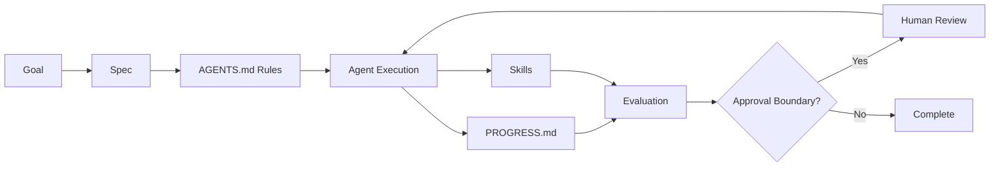

# Module 02: Workflow Operating System

## Learning Objectives

- By the end of this module, learners will be able to:
- define a workflow operating system in plain language
- identify the five core artifacts in two anchor workflows
- map each artifact to a concrete execution responsibility
- design a minimal workflow operating system for one use case
- evaluate whether a workflow is execution-ready or assumption-heavy

## Core Concept

### Definition: Workflow Operating System

A workflow operating system is the set of artifacts, rules, and checks
that makes agent execution reliable across sessions and tasks.

### Concrete Examples

Coding anchor:
- Add role-based access checks to admin endpoints.

Knowledge-work anchor:
- Prepare a vendor selection recommendation for leadership.

In both cases, the same system is used:
- `AGENTS.md` defines behavior boundaries
- `PROGRESS.md` preserves continuity
- Spec defines objective, scope, and constraints
- Skill improves repeated quality on a focused task
- Evaluation checks correctness before completion

Without an operating system, teams rely on memory, chat history, and
informal expectations. That usually leads to drift, rework, and unsafe
actions. With an operating system, work becomes inspectable,
repeatable, and easier to improve.

### Optional Metaphor

The workflow operating system is the assembly line and quality station,
not the machine doing one step.

### Practical Implication

Without explicit artifacts, agents guess. With explicit artifacts,
execution and review become testable.

## The Five Core Artifacts

### 1. `AGENTS.md`

Defines the operating contract for the workspace.

It should answer:
- What can the agent do without asking?
- What actions require approval?
- What validation is expected?
- What are the delivery rules?

### 2. `PROGRESS.md`

Creates continuity across sessions.

It should answer:
- What was done?
- What files changed?
- What validation happened?
- What should happen next?

### 3. Specs

Translate intent into executable work.

They should answer:
- What is the objective?
- What is in scope?
- What is out of scope?
- What constraints apply?
- How will success be checked?

### 4. Skills

Capture reusable instructions for recurring tasks.

They are useful when:
- a task repeats often
- a pattern is stable
- output quality depends on consistent steps

### 5. Evaluation

Prevents plausible but wrong output from being accepted.

Evaluation should check:
- correctness
- completeness
- constraint compliance
- quality
- safety

## Visual Flow

## How The System Works Together

A strong workflow usually follows this sequence:

1. Define the goal
2. Write or refine the spec
3. Check `AGENTS.md` for rules and boundaries
4. Execute work with the available context
5. Record meaningful steps in `PROGRESS.md`
6. Evaluate output against the spec
7. Escalate if the workflow hits an approval boundary

The key idea is that these artifacts reinforce each other. Specs define
the task. `AGENTS.md` defines the rules. `PROGRESS.md` preserves
continuity. Skills improve consistency. Evaluation protects quality.

## Failure Mode

Prompt-only execution fails because the workflow has no shared controls.

Typical outcomes:
- unclear scope and completion rules
- hidden assumptions across sessions
- no explicit review or approval gate
- plausible output accepted without validation

## Real Example

Coding anchor flow:
1. define RBAC endpoint scope in spec
2. enforce ask-first rules from `AGENTS.md`
3. implement and log decisions in `PROGRESS.md`
4. run role-based tests and checklist validation
5. require security signoff before merge

Knowledge-work anchor flow:
1. define vendor criteria and output contract in spec
2. enforce source and confidentiality rules from `AGENTS.md`
3. record evidence and scoring decisions in `PROGRESS.md`
4. run traceability and rubric evaluation
5. require stakeholder signoff before distribution

## Good Pattern: Artifact Mapping On Real Work

Coding anchor:
- Goal: role-based checks for admin endpoints
- `AGENTS.md`: ask-first rule for permission model changes
- Spec: endpoints in scope, non-goals, acceptance criteria
- `PROGRESS.md`: discovery, implementation, validation entries
- Skill: API security review checklist
- Evaluation: role tests + regression checks
- Approval boundary: security signoff before merge

Knowledge-work anchor:
- Goal: vendor recommendation for leadership
- `AGENTS.md`: source quality and confidentiality boundaries
- Spec: criteria, comparison scope, output format
- `PROGRESS.md`: source collection, scoring, draft refinement
- Skill: evidence quality and bias check
- Evaluation: rubric + citation traceability
- Approval boundary: stakeholder review before distribution

Result:
- less ambiguity
- easier handoff
- more visible decisions
- fewer hidden assumptions

## Bad Pattern: Prompt-Only Execution

"Use AI to handle this quickly and send me the final result."

They do not define:
- scope
- rules
- validation
- approval boundaries

Result:
- silent overreach
- unclear completion
- weak accountability
- hard-to-reproduce work

## Reflection Questions

1. Define workflow operating system in one sentence.
2. Which artifact is currently weakest in your workflow?
3. In the coding anchor, where is approval required?
4. In the knowledge-work anchor, what makes evaluation reliable?

## Summary

The workflow operating system is not overhead. It is the structure that
makes AI collaboration reliable. If you want agents to do useful work
repeatedly, you need explicit artifacts, clear boundaries, and a
visible review loop.
