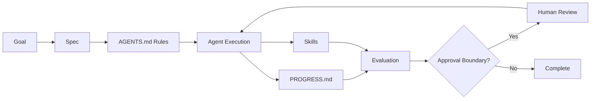

# Module 02: Workflow Operating System

## Learning Objectives

- Understand the core artifacts that make agentic work reliable
- See how `AGENTS.md`, `PROGRESS.md`, specs, skills, and evaluation work together
- Distinguish a usable workflow system from ad hoc prompting
- Design a minimal operating system for a real team workflow

## Core Concept

A workflow operating system is the set of artifacts, rules, and
checkpoints that makes agent behavior reliable across sessions and
tasks.

Without an operating system, teams rely on memory, chat history, and
informal expectations. That usually leads to drift, rework, and unsafe
actions. With an operating system, work becomes inspectable,
repeatable, and easier to improve.

## The Five Core Artifacts

### 1. `AGENTS.md`

Defines the operating contract for the workspace.

It should answer:
- What can the agent do without asking?
- What actions require approval?
- What validation is expected?
- What are the delivery rules?

### 2. `PROGRESS.md`

Creates continuity across sessions.

It should answer:
- What was done?
- What files changed?
- What validation happened?
- What should happen next?

### 3. Specs

Translate intent into executable work.

They should answer:
- What is the objective?
- What is in scope?
- What is out of scope?
- What constraints apply?
- How will success be checked?

### 4. Skills

Capture reusable instructions for recurring tasks.

They are useful when:
- a task repeats often
- a pattern is stable
- output quality depends on consistent steps

### 5. Evaluation

Prevents plausible but wrong output from being accepted.

Evaluation should check:
- correctness
- completeness
- constraint compliance
- quality
- safety

## Visual Flow

## How The System Works Together

A strong workflow usually follows this sequence:

1. Define the goal
2. Write or refine the spec
3. Check `AGENTS.md` for rules and boundaries
4. Execute work with the available context
5. Record meaningful steps in `PROGRESS.md`
6. Evaluate output against the spec
7. Escalate if the workflow hits an approval boundary

The key idea is that these artifacts reinforce each other. Specs define
the task. `AGENTS.md` defines the rules. `PROGRESS.md` preserves
continuity. Skills improve consistency. Evaluation protects quality.

## Good Pattern

A team wants to add a feature.

They:
- write a short spec
- use `AGENTS.md` to define safe behavior
- log progress after each meaningful step
- run an evaluation checklist before completion

Result:
- less ambiguity
- easier handoff
- more visible decisions
- fewer hidden assumptions

## Bad Pattern

A team says:

"Use AI to build this feature and let me know when it's done."

They do not define:
- scope
- rules
- validation
- approval boundaries

Result:
- silent overreach
- unclear completion
- weak accountability
- hard-to-reproduce work

## Example: Developer Workflow

A developer wants help implementing a feature.

The operating system includes:
- `AGENTS.md` with repo rules and ask-first actions
- a feature spec with success criteria
- `PROGRESS.md` entries after scaffold, implementation, and validation
- a code-review skill
- a release-readiness checklist

## Example: Knowledge Work Workflow

A team member wants an AI-assisted research synthesis.

The operating system includes:
- `AGENTS.md` with confidentiality and approval boundaries
- a research brief spec
- `PROGRESS.md` entries after source review and synthesis draft
- a synthesis skill
- an evaluation checklist for source quality, completeness, and bias

## Reflection Questions

1. Which of these artifacts do you already use, even informally?
2. Which artifact is currently missing from your workflow?
3. Where does your team rely too heavily on memory or chat history?
4. What actions should always require approval in your environment?

## Summary

The workflow operating system is not overhead. It is the structure that
makes AI collaboration reliable. If you want agents to do useful work
repeatedly, you need explicit artifacts, clear boundaries, and a
visible review loop.
