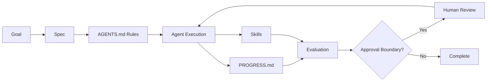

# Module 02 Slides Outline

## Slide 1: What a Workflow Operating System Is

- definition in plain language
- reliable execution across sessions

## Slide 2: Why Teams Need One

- Drift without structure
- Hidden assumptions
- Weak handoffs
- Unsafe actions

## Slide 3: The Five Core Artifacts

- `AGENTS.md`
- `PROGRESS.md`
- specs
- skills
- evaluation

## Slide 4: `AGENTS.md`

- rules
- permissions
- approval boundaries
- delivery expectations

## Slide 5: `PROGRESS.md`

- continuity
- accountability
- handoff support

## Slide 6: Specs

- objective
- scope
- constraints
- success criteria

## Slide 7: Skills

- reusable capabilities
- consistency across repeated tasks

## Slide 8: Evaluation

- correctness
- completeness
- safety
- quality

## Slide 9: Artifact Flow Diagram

## Slide 10: How the Artifacts Work Together

- goal -> spec -> rules -> execution -> progress -> evaluation

## Slide 11: Coding Anchor Mapping

- role-based admin endpoint checks
- artifacts mapped end to end

## Slide 12: Knowledge-Work Anchor Mapping

- vendor recommendation brief
- artifacts mapped end to end

## Slide 13: Discussion

- what artifact is weakest in your workflow today?
